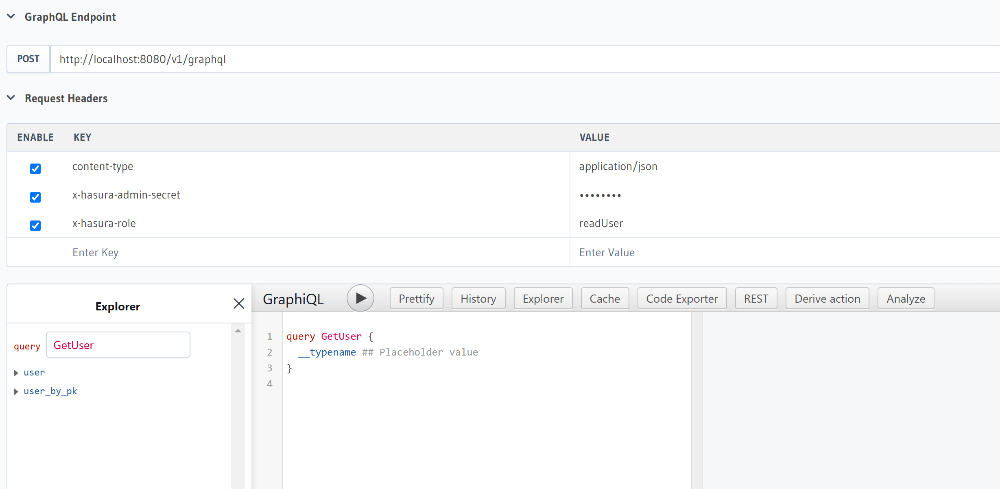

# graphql

- `git clone https://github.com/weilingpan/graphql.git`
- `bash run.sh`
- `python3 main.py`

# 新增 db migration(使用alembic為SQLAlchemy做migration)
- `alembic init alembic` 會建立出 alembic.ini 檔案與 alembic folder
- 更新 alembic/env.py 設定你的 SQLAlchemy Model
- `alembic revision --autogenerate -m "Do migration"` 會自動建立一個 migration file to alembic/versions/xxx.py
- `alembic upgrade head` 實際執行 db migration
- `alembic history --verbose` 查看歷史db migration紀錄
- `alembic downgrade -1` 回滾到上一個版本

- `alembic current` 檢查當前的 migration 狀態

## Hasura 可以限制 role 只能讀取
